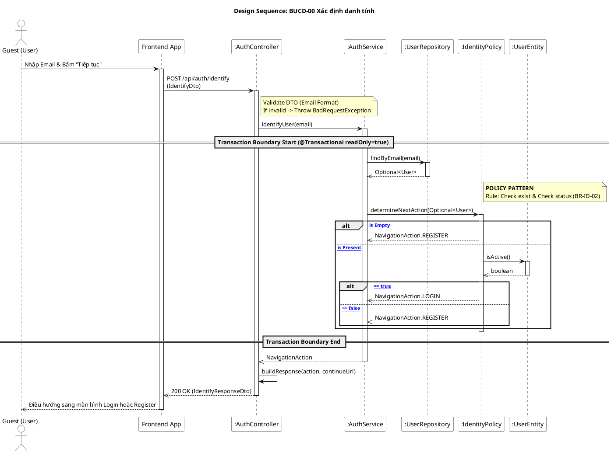
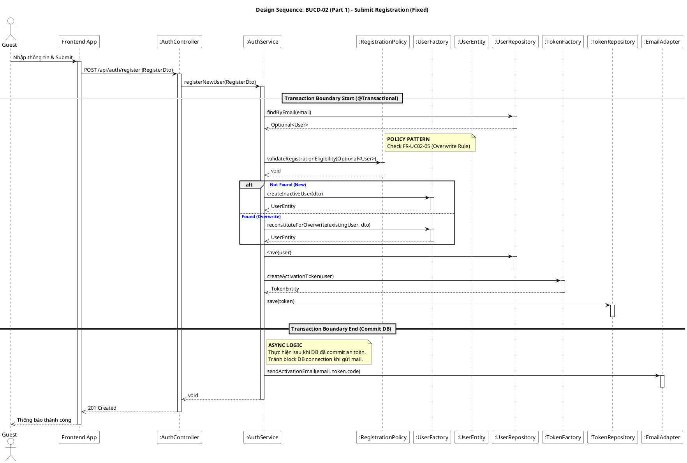
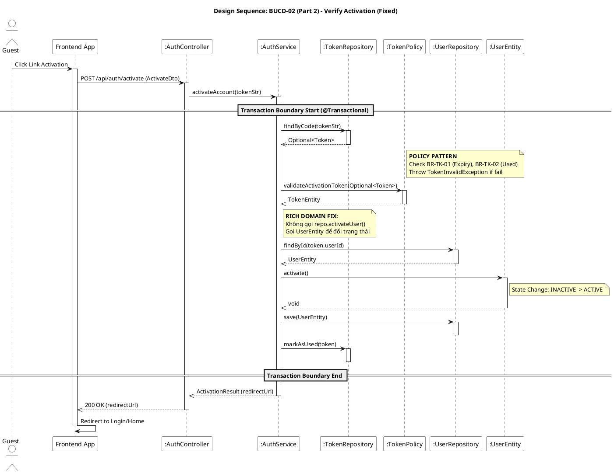
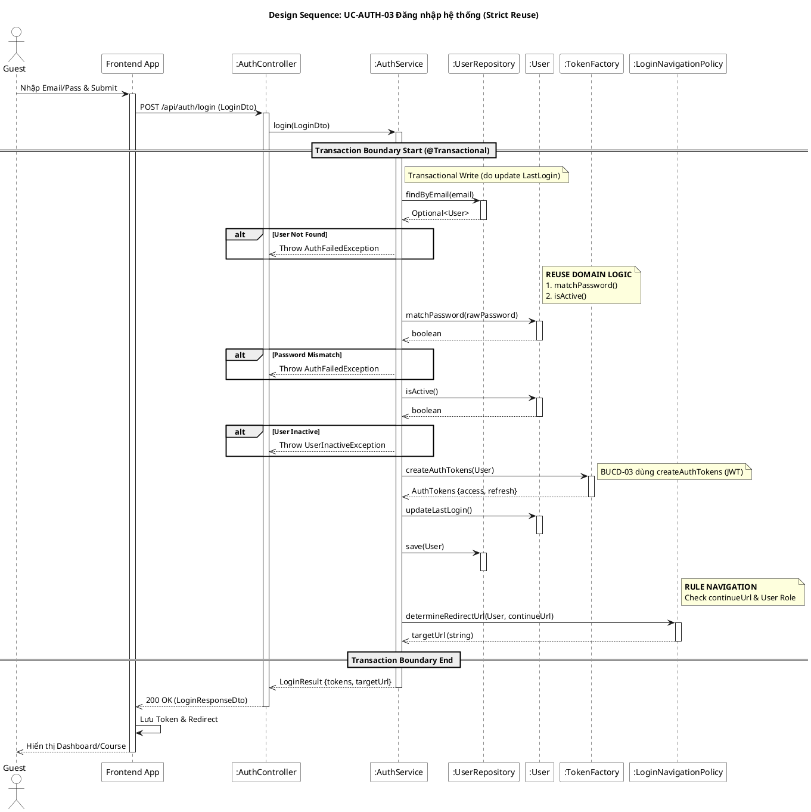
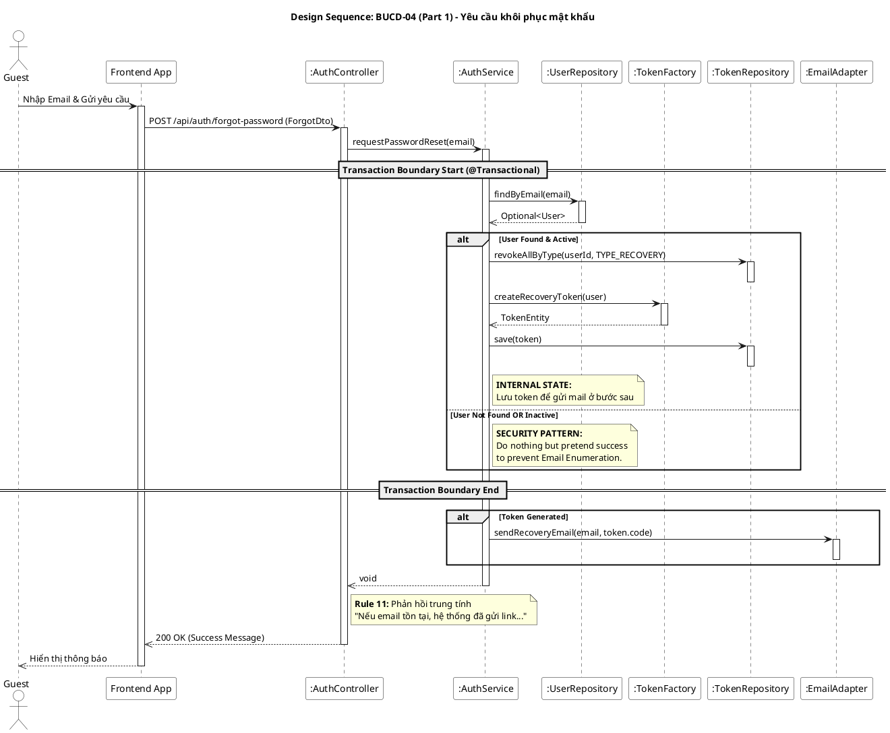
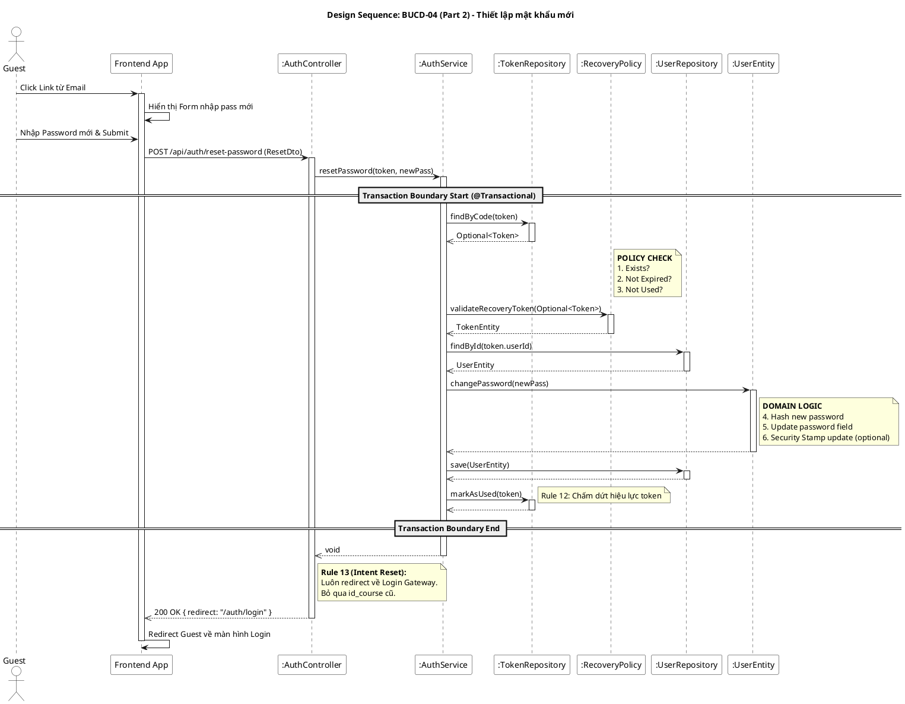

# Cụm 1: 

# UC 00

```plantuml
@startuml
skinparam lifelineBackgroundColor White
skinparam participantBackgroundColor White
skinparam actorBackgroundColor White
skinparam noteBackgroundColor #FEFECE

actor "Guest (User)" as Actor
participant "Frontend App" as FE
participant ":AuthController" as Controller
participant ":AuthService" as Service
participant ":UserRepository" as UserRepo
participant ":IdentityPolicy" as Policy
participant ":UserEntity" as UserEntity

title Design Sequence: BUCD-00 Xác định danh tính

'--- Interaction Layer ---
Actor -> FE: Nhập Email & Bấm "Tiếp tục"
activate FE

    '--- API Layer ---
    FE -> Controller: POST /api/auth/identify \n(IdentifyDto)
    activate Controller

    '--- Presentation Layer ---
    note right of Controller
        Validate DTO (Email Format)
        If invalid -> Throw BadRequestException
    end note

    Controller -> Service: identifyUser(email)
    activate Service

    == Transaction Boundary Start (@Transactional readOnly=true) ==

        '--- Step 1: Retrieve State ---
        Service -> UserRepo: findByEmail(email)
        activate UserRepo
        UserRepo -->> Service: Optional<User>
        deactivate UserRepo

        '--- Step 2: Decision Making ---
        note right of Policy
            **POLICY PATTERN**
            Rule: Check exist & Check status (BR-ID-02)
        end note

        Service -> Policy: determineNextAction(Optional<User>)
        activate Policy

        alt [User is Empty]
            Policy -->> Service: NavigationAction.REGISTER
        else [User is Present]
            '--- Rich Domain Check ---
            Policy -> UserEntity: isActive()
            activate UserEntity
            UserEntity -->> Policy: boolean
            deactivate UserEntity

            alt [isActive == true]
                Policy -->> Service: NavigationAction.LOGIN
            else [isActive == false]
                Policy -->> Service: NavigationAction.REGISTER
            end
        end

        deactivate Policy

    == Transaction Boundary End ==

    Service -->> Controller: NavigationAction
    deactivate Service

    '--- Response Construction ---
    Controller -> Controller: buildResponse(action, continueUrl)
    Controller -->> FE: 200 OK (IdentifyResponseDto)
    deactivate Controller

FE -->> Actor: Điều hướng sang màn hình Login hoặc Register
deactivate FE

@enduml
```

# UC 02
A. SUBMIT REGISTRATION

```plantuml
@startuml
skinparam lifelineBackgroundColor White
skinparam participantBackgroundColor White
skinparam actorBackgroundColor White
skinparam note {
  BackgroundColor #FEFECE
}

actor "Guest" as Actor
participant "Frontend App" as FE
participant ":AuthController" as Controller
participant ":AuthService" as Service
participant ":RegistrationPolicy" as Policy
participant ":UserFactory" as Factory
participant ":UserEntity" as UserEntity
participant ":UserRepository" as UserRepo
participant ":TokenFactory" as TokenFactory
participant ":TokenRepository" as TokenRepo
participant ":EmailAdapter" as EmailClient

title Design Sequence: BUCD-02 (Part 1) - Submit Registration (Fixed)

'--- Interaction ---
Actor -> FE: Nhập thông tin & Submit
activate FE

    '--- API Call ---
    FE -> Controller: POST /api/auth/register (RegisterDto)
    activate Controller

    Controller -> Service: registerNewUser(RegisterDto)
    activate Service

    == Transaction Boundary Start (@Transactional) ==

        '--- Step 1: Check Policy ---
        Service -> UserRepo: findByEmail(email)
        activate UserRepo
        UserRepo -->> Service: Optional<User>
        deactivate UserRepo

        note right of Policy
            **POLICY PATTERN**
            Check FR-UC02-05 (Overwrite Rule)
        end note

        Service -> Policy: validateRegistrationEligibility(Optional<User>)
        activate Policy
        Policy -->> Service: void
        deactivate Policy

        '--- Step 2: Create/Update User ---
        alt [User Not Found (New)]
            Service -> Factory: createInactiveUser(dto)
            activate Factory
            Factory -->> Service: UserEntity
            deactivate Factory
        else [User Found (Overwrite)]
            Service -> Factory: reconstituteForOverwrite(existingUser, dto)
            activate Factory
            Factory -->> Service: UserEntity
            deactivate Factory
        end

        Service -> UserRepo: save(user)
        activate UserRepo
        deactivate UserRepo

        '--- Step 3: Token Generation ---
        Service -> TokenFactory: createActivationToken(user)
        activate TokenFactory
        TokenFactory -->> Service: TokenEntity
        deactivate TokenFactory

        Service -> TokenRepo: save(token)
        activate TokenRepo
        deactivate TokenRepo

    == Transaction Boundary End (Commit DB) ==

    '--- Step 4: Send Email (Async) ---
    note right of Service
        **ASYNC LOGIC**
        Thực hiện sau khi DB đã commit an toàn.
        Tránh block DB connection khi gửi mail.
    end note

    Service -> EmailClient: sendActivationEmail(email, token.code)
    activate EmailClient
    deactivate EmailClient

    Service -->> Controller: void
    deactivate Service

    Controller -->> FE: 201 Created
    deactivate Controller

FE -->> Actor: Thông báo thành công
deactivate FE

@enduml
```

B. VERIFY ACTIVATION

```plantuml
@startuml
skinparam lifelineBackgroundColor White
skinparam participantBackgroundColor White
skinparam actorBackgroundColor White
skinparam note {
  BackgroundColor #FEFECE
}

actor "Guest" as Actor
participant "Frontend App" as FE
participant ":AuthController" as Controller
participant ":AuthService" as Service
participant ":TokenRepository" as TokenRepo
participant ":TokenPolicy" as Policy
participant ":UserRepository" as UserRepo
participant ":UserEntity" as UserEntity

title Design Sequence: BUCD-02 (Part 2) - Verify Activation (Fixed)

'--- Interaction ---
Actor -> FE: Click Link Activation
activate FE

    FE -> Controller: POST /api/auth/activate (ActivateDto)
    activate Controller

    Controller -> Service: activateAccount(tokenStr)
    activate Service

    == Transaction Boundary Start (@Transactional) ==

        '--- Step 1: Validate Token ---
        Service -> TokenRepo: findByCode(tokenStr)
        activate TokenRepo
        TokenRepo -->> Service: Optional<Token>
        deactivate TokenRepo

        note right of Policy
            **POLICY PATTERN**
            Check BR-TK-01 (Expiry), BR-TK-02 (Used)
            Throw TokenInvalidException if fail
        end note

        Service -> Policy: validateActivationToken(Optional<Token>)
        activate Policy
        Policy -->> Service: TokenEntity
        deactivate Policy

        '--- Step 2: Activate User (RICH DOMAIN) ---
        note right of Service
            **RICH DOMAIN FIX:**
            Không gọi repo.activateUser()
            Gọi UserEntity để đổi trạng thái
        end note

        Service -> UserRepo: findById(token.userId)
        activate UserRepo
        UserRepo -->> Service: UserEntity
        deactivate UserRepo

        Service -> UserEntity: activate()
        activate UserEntity

        note right of UserEntity
            State Change: INACTIVE -> ACTIVE
        end note

        UserEntity -->> Service: void
        deactivate UserEntity

        Service -> UserRepo: save(UserEntity)
        activate UserRepo
        deactivate UserRepo

        '--- Step 3: Consume Token ---
        Service -> TokenRepo: markAsUsed(token)
        activate TokenRepo
        deactivate TokenRepo

    == Transaction Boundary End ==

    Service -->> Controller: ActivationResult (redirectUrl)
    deactivate Service

    Controller -->> FE: 200 OK (redirectUrl)
    deactivate Controller

FE -> FE: Redirect to Login/Home
deactivate FE

@enduml
```

# UC 03

```plantuml
@startuml
skinparam sequence {
    LifeLineBackgroundColor White
    ParticipantBackgroundColor White
    ActorBackgroundColor White
    NoteBackgroundColor #FEFECE
}

actor "Guest" as Actor
participant "Frontend App" as FE
participant ":AuthController" as Controller
participant ":AuthService" as Service
participant ":UserRepository" as UserRepo
participant ":User" as DomainUser
participant ":TokenFactory" as TokenFactory
participant ":LoginNavigationPolicy" as Policy

title Design Sequence: UC-AUTH-03 Đăng nhập hệ thống (Strict Reuse)

'--- Interaction ---
Actor -> FE: Nhập Email/Pass & Submit
activate FE

    '--- API Call ---
    FE -> Controller: POST /api/auth/login (LoginDto)
    activate Controller

    Controller -> Service: login(LoginDto)
    activate Service

    '--- TRANSACTION START ---
    == Transaction Boundary Start (@Transactional) ==
    note right of Service: Transactional Write (do update LastLogin)

        '--- Step 1: Retrieve User (Reuse UserRepo) ---
        Service -> UserRepo: findByEmail(email)
        activate UserRepo
        UserRepo -->> Service: Optional<User>
        deactivate UserRepo

        alt User Not Found
            Service -->> Controller: Throw AuthFailedException
        end

        '--- Step 2: Rich Domain Validation (Reuse Domain) ---
        note right of DomainUser
           **REUSE DOMAIN LOGIC**
           1. matchPassword()
           2. isActive()
        end note

        Service -> DomainUser: matchPassword(rawPassword)
        activate DomainUser
        DomainUser -->> Service: boolean
        deactivate DomainUser

        alt Password Mismatch
             Service -->> Controller: Throw AuthFailedException
        end

        Service -> DomainUser: isActive()
        activate DomainUser
        DomainUser -->> Service: boolean
        deactivate DomainUser

        alt User Inactive
             Service -->> Controller: Throw UserInactiveException
        end

        '--- Step 3: Issue Tokens (Reuse TokenFactory) ---
        Service -> TokenFactory: createAuthTokens(User)
        activate TokenFactory
        note right: BUCD-03 dùng createAuthTokens (JWT)
        TokenFactory -->> Service: AuthTokens {access, refresh}
        deactivate TokenFactory

        '--- Step 4: Update State (Side Effect) ---
        Service -> DomainUser: updateLastLogin()
        activate DomainUser
        deactivate DomainUser

        Service -> UserRepo: save(User)
        activate UserRepo
        deactivate UserRepo

        '--- Step 5: Navigation (Policy Pattern) ---
        note right of Policy
           **RULE NAVIGATION**
           Check continueUrl & User Role
        end note

        Service -> Policy: determineRedirectUrl(User, continueUrl)
        activate Policy
        Policy -->> Service: targetUrl (string)
        deactivate Policy

    '--- TRANSACTION END ---
    == Transaction Boundary End ==

    Service -->> Controller: LoginResult {tokens, targetUrl}
    deactivate Service

    Controller -->> FE: 200 OK (LoginResponseDto)
    deactivate Controller

FE -> FE: Lưu Token & Redirect
FE -->> Actor: Hiển thị Dashboard/Course
deactivate FE

@enduml
```

# UC 04
A/REQUEST RECOVERY

```plantuml
@startuml
skinparam sequence {
    LifeLineBackgroundColor White
    ParticipantBackgroundColor White
    ActorBackgroundColor White
    NoteBackgroundColor #FEFECE
}

'--- Mapping from Use-case.md (UC-AUTH-04) ---
actor "Guest" as Actor
participant "Frontend App" as FE
participant ":AuthController" as Controller
participant ":AuthService" as Service
participant ":UserRepository" as UserRepo
participant ":TokenFactory" as TokenFactory
participant ":TokenRepository" as TokenRepo
participant ":EmailAdapter" as EmailClient

title Design Sequence: BUCD-04 (Part 1) - Yêu cầu khôi phục mật khẩu

'--- Interaction ---
Actor -> FE: Nhập Email & Gửi yêu cầu
activate FE

    FE -> Controller: POST /api/auth/forgot-password (ForgotDto)
    activate Controller

    Controller -> Service: requestPasswordReset(email)
    activate Service

    '--- TRANSACTION START ---
    == Transaction Boundary Start (@Transactional) ==

        '--- Step 1: Check User (Silent Check - Rule 10) ---
        Service -> UserRepo: findByEmail(email)
        activate UserRepo
        UserRepo -->> Service: Optional<User>
        deactivate UserRepo

        alt User Found & Active
            '--- Step 2: Revoke Old Tokens (Rule 12) ---
            Service -> TokenRepo: revokeAllByType(userId, TYPE_RECOVERY)
            activate TokenRepo
            deactivate TokenRepo

            '--- Step 3: Create New Token ---
            Service -> TokenFactory: createRecoveryToken(user)
            activate TokenFactory
            TokenFactory -->> Service: TokenEntity
            deactivate TokenFactory

            Service -> TokenRepo: save(token)
            activate TokenRepo
            deactivate TokenRepo

            note right of Service
               **INTERNAL STATE:**
               Lưu token để gửi mail ở bước sau
            end note
        else User Not Found OR Inactive
            note right of Service
               **SECURITY PATTERN:**
               Do nothing but pretend success
               to prevent Email Enumeration.
            end note
        end

    '--- TRANSACTION END ---
    == Transaction Boundary End ==

    '--- Step 4: Async Email (Only if token generated) ---
    alt Token Generated
        Service -> EmailClient: sendRecoveryEmail(email, token.code)
        activate EmailClient
        deactivate EmailClient
    end

    Service -->> Controller: void
    deactivate Service

    note right of Controller
       **Rule 11:** Phản hồi trung tính
       "Nếu email tồn tại, hệ thống đã gửi link..."
    end note

    Controller -->> FE: 200 OK (Success Message)
    deactivate Controller

FE -->> Actor: Hiển thị thông báo
deactivate FE

@enduml
```

B.RESET PASSWORD

```plantuml
@startuml
skinparam sequence {
    LifeLineBackgroundColor White
    ParticipantBackgroundColor White
    ActorBackgroundColor White
    NoteBackgroundColor #FEFECE
}

actor "Guest" as Actor
participant "Frontend App" as FE
participant ":AuthController" as Controller
participant ":AuthService" as Service
participant ":TokenRepository" as TokenRepo
participant ":RecoveryPolicy" as Policy
participant ":UserRepository" as UserRepo
participant ":UserEntity" as UserEntity

title Design Sequence: BUCD-04 (Part 2) - Thiết lập mật khẩu mới

'--- Interaction ---
Actor -> FE: Click Link từ Email
activate FE
FE -> FE: Hiển thị Form nhập pass mới
Actor -> FE: Nhập Password mới & Submit

    '--- API Call ---
    FE -> Controller: POST /api/auth/reset-password (ResetDto)
    activate Controller

    Controller -> Service: resetPassword(token, newPass)
    activate Service

    '--- TRANSACTION START ---
    == Transaction Boundary Start (@Transactional) ==

        '--- Step 1: Validate Token ---
        Service -> TokenRepo: findByCode(token)
        activate TokenRepo
        TokenRepo -->> Service: Optional<Token>
        deactivate TokenRepo

        note right of Policy
            **POLICY CHECK**
            1. Exists?
            2. Not Expired?
            3. Not Used?
        end note

        Service -> Policy: validateRecoveryToken(Optional<Token>)
        activate Policy
        Policy -->> Service: TokenEntity
        deactivate Policy

        '--- Step 2: Change Password (Rich Domain) ---
        Service -> UserRepo: findById(token.userId)
        activate UserRepo
        UserRepo -->> Service: UserEntity
        deactivate UserRepo

        Service -> UserEntity: changePassword(newPass)
        activate UserEntity
        note right of UserEntity
             **DOMAIN LOGIC**
             4. Hash new password
             5. Update password field
             6. Security Stamp update (optional)
        end note
        UserEntity -->> Service
        deactivate UserEntity

        Service -> UserRepo: save(UserEntity)
        activate UserRepo
        UserRepo -->> Service
        deactivate UserRepo

        '--- Step 3: Cleanup ---
        Service -> TokenRepo: markAsUsed(token)
        activate TokenRepo
        note right: Rule 12: Chấm dứt hiệu lực token
        TokenRepo -->> Service
        deactivate TokenRepo

    '--- TRANSACTION END ---
    == Transaction Boundary End ==

    Service -->> Controller: void
    deactivate Service

    note right of Controller
        **Rule 13 (Intent Reset):**
        Luôn redirect về Login Gateway.
        Bỏ qua id_course cũ.
    end note

    Controller -->> FE: 200 OK { redirect: "/auth/login" }
    deactivate Controller

FE -> FE: Redirect Guest về màn hình Login
deactivate FE

@enduml
```

