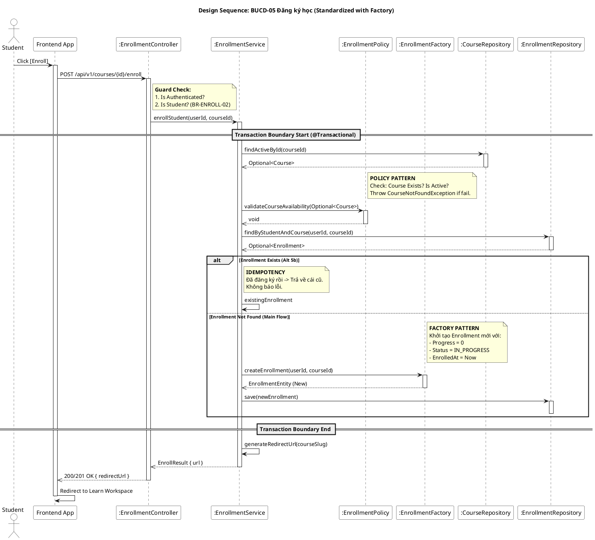
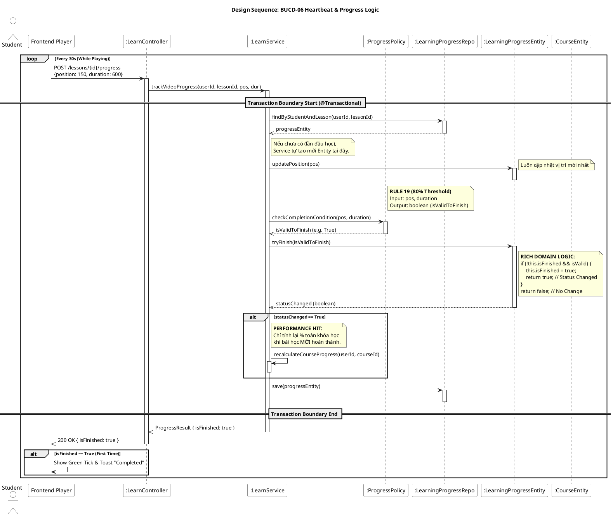
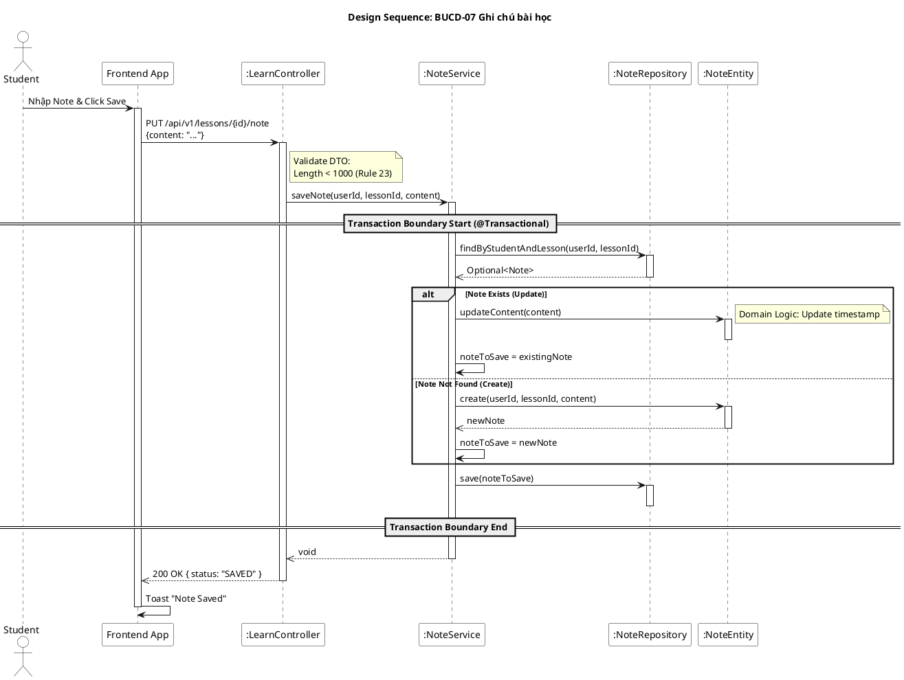
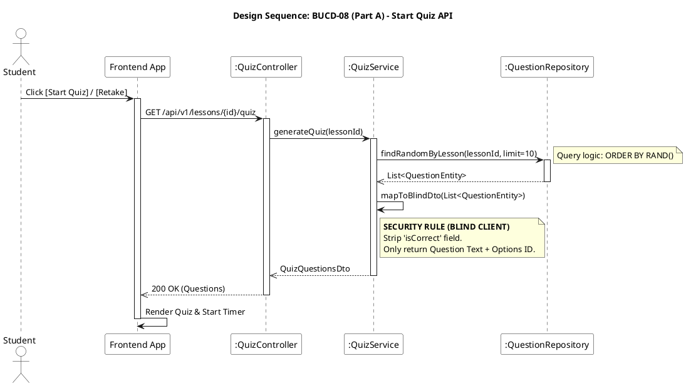
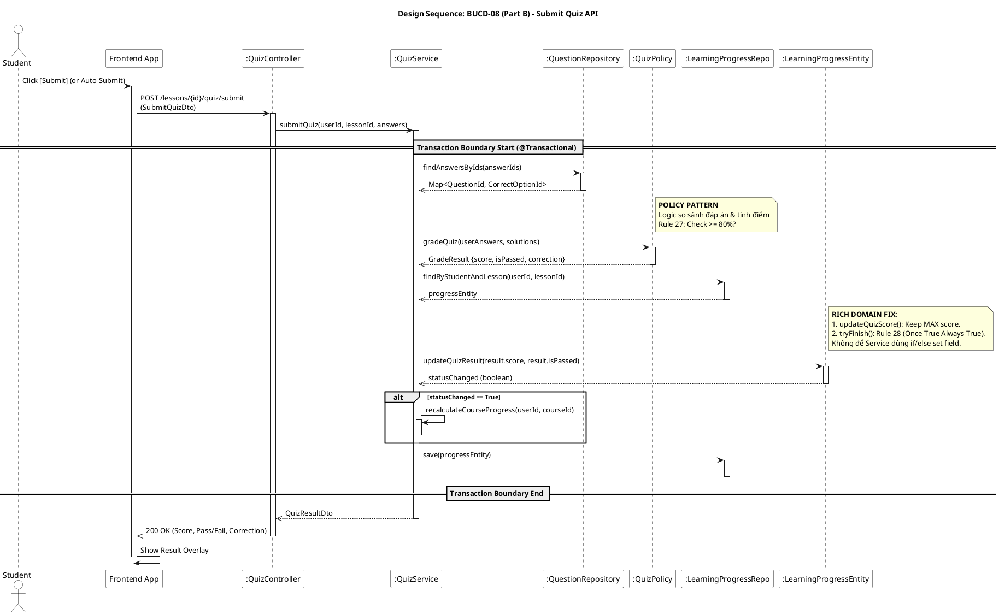

# Cụm 2
# UC 05

```plantuml
@startuml
skinparam sequence {
    LifeLineBackgroundColor White
    ParticipantBackgroundColor White
    ActorBackgroundColor White
    NoteBackgroundColor #FEFECE
}

actor "Student" as Actor
participant "Frontend App" as FE
participant ":EnrollmentController" as Controller
participant ":EnrollmentService" as Service
participant ":EnrollmentPolicy" as Policy
participant ":EnrollmentFactory" as Factory
participant ":CourseRepository" as CourseRepo
participant ":EnrollmentRepository" as EnrollRepo

title Design Sequence: BUCD-05 Đăng ký học (Standardized with Factory)

'--- Interaction ---
Actor -> FE: Click [Enroll]
activate FE

    '--- API Call ---
    FE -> Controller: POST /api/v1/courses/{id}/enroll
    activate Controller

    '--- Guard Layer ---
    note right of Controller
       **Guard Check:**
       1. Is Authenticated?
       2. Is Student? (BR-ENROLL-02)
    end note

    Controller -> Service: enrollStudent(userId, courseId)
    activate Service

    '--- TRANSACTION START ---
    == Transaction Boundary Start (@Transactional) ==

        '--- Step 1: Validate Course (Infra + Domain) ---
        Service -> CourseRepo: findActiveById(courseId)
        activate CourseRepo
        CourseRepo -->> Service: Optional<Course>
        deactivate CourseRepo

        note right of Policy
           **POLICY PATTERN**
           Check: Course Exists? Is Active?
           Throw CourseNotFoundException if fail.
        end note

        Service -> Policy: validateCourseAvailability(Optional<Course>)
        activate Policy
        Policy -->> Service: void
        deactivate Policy

        '--- Step 2: Idempotency Check (Infra) ---
        Service -> EnrollRepo: findByStudentAndCourse(userId, courseId)
        activate EnrollRepo
        EnrollRepo -->> Service: Optional<Enrollment>
        deactivate EnrollRepo

        alt Enrollment Exists (Alt 5b)
             note right of Service
                **IDEMPOTENCY**
                Đã đăng ký rồi -> Trả về cái cũ.
                Không báo lỗi.
             end note
             Service -> Service: existingEnrollment
        else Enrollment Not Found (Main Flow)
             '--- Step 3: Creation (FACTORY PATTERN) ---
             note right of Factory
                **FACTORY PATTERN**
                Khởi tạo Enrollment mới với:
                - Progress = 0
                - Status = IN_PROGRESS
                - EnrolledAt = Now
             end note

             Service -> Factory: createEnrollment(userId, courseId)
             activate Factory
             Factory -->> Service: EnrollmentEntity (New)
             deactivate Factory

             Service -> EnrollRepo: save(newEnrollment)
             activate EnrollRepo
             deactivate EnrollRepo
        end

    '--- TRANSACTION END ---
    == Transaction Boundary End ==

    '--- Step 4: Response ---
    Service -> Service: generateRedirectUrl(courseSlug)

    Service -->> Controller: EnrollResult { url }
    deactivate Service

    Controller -->> FE: 200/201 OK { redirectUrl }
    deactivate Controller

FE -> FE: Redirect to Learn Workspace
deactivate FE

@enduml
```

# UC 06

```plantuml
@startuml
skinparam sequence {
    LifeLineBackgroundColor White
    ParticipantBackgroundColor White
    ActorBackgroundColor White
    NoteBackgroundColor #FEFECE
}

actor "Student" as Actor
participant "Frontend Player" as FE
participant ":LearnController" as Controller
participant ":LearnService" as Service
participant ":ProgressPolicy" as Policy
participant ":LearningProgressRepo" as Repo
participant ":LearningProgressEntity" as Entity
participant ":CourseEntity" as CourseEntity

title Design Sequence: BUCD-06 Heartbeat & Progress Logic

'--- Loop 30s ---
loop Every 30s (While Playing)

    '--- Interaction ---
    FE -> Controller: POST /lessons/{id}/progress \n{position: 150, duration: 600}
    activate Controller

    Controller -> Service: trackVideoProgress(userId, lessonId, pos, dur)
    activate Service

    '--- TRANSACTION START ---
    == Transaction Boundary Start (@Transactional) ==

        '--- Step 1: Load State ---
        Service -> Repo: findByStudentAndLesson(userId, lessonId)
        activate Repo
        Repo -->> Service: progressEntity
        deactivate Repo

        note right of Service
            Nếu chưa có (lần đầu học),
            Service tự tạo mới Entity tại đây.
        end note

        '--- Step 2: Update Position (Last Write Wins) ---
        Service -> Entity: updatePosition(pos)
        activate Entity
        note right: Luôn cập nhật vị trí mới nhất
        deactivate Entity

        '--- Step 3: Check Completion Policy ---
        note right of Policy
           **RULE 19 (80% Threshold)**
           Input: pos, duration
           Output: boolean (isValidToFinish)
        end note

        Service -> Policy: checkCompletionCondition(pos, duration)
        activate Policy
        Policy -->> Service: isValidToFinish (e.g. True)
        deactivate Policy

        '--- Step 4: Try Finish (Once True Always True) ---
        Service -> Entity: tryFinish(isValidToFinish)
        activate Entity
        note right of Entity
           **RICH DOMAIN LOGIC:**
           if (!this.isFinished && isValid) {
               this.isFinished = true;
               return true; // Status Changed
           }
           return false; // No Change
        end note
        Entity -->> Service: statusChanged (boolean)
        deactivate Entity

        '--- Step 5: Side Effect (Optimization) ---
        alt statusChanged == True
             note right of Service
                **PERFORMANCE HIT:**
                Chỉ tính lại % toàn khóa học
                khi bài học MỚI hoàn thành.
             end note
             Service -> Service: recalculateCourseProgress(userId, courseId)
             activate Service
             deactivate Service
        end

        '--- Step 6: Persist ---
        Service -> Repo: save(progressEntity)
        activate Repo
        deactivate Repo

    '--- TRANSACTION END ---
    == Transaction Boundary End ==

    Service -->> Controller: ProgressResult { isFinished: true }
    deactivate Service

    Controller -->> FE: 200 OK { isFinished: true }
    deactivate Controller

    '--- UI Update ---
    alt isFinished == True (First Time)
        FE -> FE: Show Green Tick & Toast "Completed"
    end

end loop

@enduml
```

# UC 07

```plantuml
@startuml
skinparam sequence {
    LifeLineBackgroundColor White
    ParticipantBackgroundColor White
    ActorBackgroundColor White
    NoteBackgroundColor #FEFECE
}

actor "Student" as Actor
participant "Frontend App" as FE
participant ":LearnController" as Controller
participant ":NoteService" as Service
participant ":NoteRepository" as Repo
participant ":NoteEntity" as Entity

title Design Sequence: BUCD-07 Ghi chú bài học

'--- Interaction ---
Actor -> FE: Nhập Note & Click Save
activate FE

    '--- API Call ---
    FE -> Controller: PUT /api/v1/lessons/{id}/note \n{content: "..."}
    activate Controller

    '--- Guard Layer ---
    note right of Controller
       Validate DTO:
       Length < 1000 (Rule 23)
    end note

    Controller -> Service: saveNote(userId, lessonId, content)
    activate Service

    '--- TRANSACTION START ---
    == Transaction Boundary Start (@Transactional) ==

        '--- Step 1: Check Existence ---
        Service -> Repo: findByStudentAndLesson(userId, lessonId)
        activate Repo
        Repo -->> Service: Optional<Note>
        deactivate Repo

        alt Note Exists (Update)
             Service -> Entity: updateContent(content)
             activate Entity
             note right: Domain Logic: Update timestamp
             deactivate Entity

             Service -> Service: noteToSave = existingNote
        else Note Not Found (Create)
             Service -> Entity: create(userId, lessonId, content)
             activate Entity
             Entity -->> Service: newNote
             deactivate Entity

             Service -> Service: noteToSave = newNote
        end

        '--- Step 2: Persist ---
        Service -> Repo: save(noteToSave)
        activate Repo
        deactivate Repo

    '--- TRANSACTION END ---
    == Transaction Boundary End ==

    Service -->> Controller: void
    deactivate Service

    Controller -->> FE: 200 OK { status: "SAVED" }
    deactivate Controller

FE -> FE: Toast "Note Saved"
deactivate FE

@enduml
```
# UC 08

A.START QUIZ

```plantuml
@startuml
skinparam sequence {
    LifeLineBackgroundColor White
    ParticipantBackgroundColor White
    ActorBackgroundColor White
    NoteBackgroundColor #FEFECE
}

actor "Student" as Actor
participant "Frontend App" as FE
participant ":QuizController" as Controller
participant ":QuizService" as Service
participant ":QuestionRepository" as QRepo

title Design Sequence: BUCD-08 (Part A) - Start Quiz API

'--- Interaction ---
Actor -> FE: Click [Start Quiz] / [Retake]
activate FE

    '--- API Call ---
    FE -> Controller: GET /api/v1/lessons/{id}/quiz
    activate Controller

    Controller -> Service: generateQuiz(lessonId)
    activate Service

    '--- LOGIC START (No Transaction Write needed) ---

    '--- Step 1: Get Random Questions ---
    Service -> QRepo: findRandomByLesson(lessonId, limit=10)
    activate QRepo
    note right: Query logic: ORDER BY RAND()
    QRepo -->> Service: List<QuestionEntity>
    deactivate QRepo

    '--- Step 2: Data Transformation (Security) ---
    Service -> Service: mapToBlindDto(List<QuestionEntity>)
    note right of Service
       **SECURITY RULE (BLIND CLIENT)**
       Strip 'isCorrect' field.
       Only return Question Text + Options ID.
    end note

    Service -->> Controller: QuizQuestionsDto
    deactivate Service

    Controller -->> FE: 200 OK (Questions)
    deactivate Controller

FE -> FE: Render Quiz & Start Timer
deactivate FE

@enduml
```

B. SUBMIT QUIZ

```plantuml
@startuml
skinparam sequence {
    LifeLineBackgroundColor White
    ParticipantBackgroundColor White
    ActorBackgroundColor White
    NoteBackgroundColor #FEFECE
}

actor "Student" as Actor
participant "Frontend App" as FE
participant ":QuizController" as Controller
participant ":QuizService" as Service
participant ":QuestionRepository" as QRepo
participant ":QuizPolicy" as Policy
participant ":LearningProgressRepo" as ProgRepo
participant ":LearningProgressEntity" as Entity

title Design Sequence: BUCD-08 (Part B) - Submit Quiz API

'--- Interaction ---
Actor -> FE: Click [Submit] (or Auto-Submit)
activate FE

    '--- API Call ---
    FE -> Controller: POST /lessons/{id}/quiz/submit \n(SubmitQuizDto)
    activate Controller

    Controller -> Service: submitQuiz(userId, lessonId, answers)
    activate Service

    '--- TRANSACTION START ---
    == Transaction Boundary Start (@Transactional) ==

        '--- Step 1: Get Solutions (Infra) ---
        Service -> QRepo: findAnswersByIds(answerIds)
        activate QRepo
        QRepo -->> Service: Map<QuestionId, CorrectOptionId>
        deactivate QRepo

        '--- Step 2: Grading (POLICY PATTERN) ---
        note right of Policy
           **POLICY PATTERN**
           Logic so sánh đáp án & tính điểm
           Rule 27: Check >= 80%?
        end note

        Service -> Policy: gradeQuiz(userAnswers, solutions)
        activate Policy
        Policy -->> Service: GradeResult {score, isPassed, correction}
        deactivate Policy

        '--- Step 3: Update Progress (RICH DOMAIN) ---
        Service -> ProgRepo: findByStudentAndLesson(userId, lessonId)
        activate ProgRepo
        ProgRepo -->> Service: progressEntity
        deactivate ProgRepo

        note right of Entity
           **RICH DOMAIN FIX:**
           1. updateQuizScore(): Keep MAX score.
           2. tryFinish(): Rule 28 (Once True Always True).
           Không để Service dùng if/else set field.
        end note

        Service -> Entity: updateQuizResult(result.score, result.isPassed)
        activate Entity
        Entity -->> Service: statusChanged (boolean)
        deactivate Entity

        '--- Step 4: Side Effect (Course %) ---
        alt statusChanged == True
             Service -> Service: recalculateCourseProgress(userId, courseId)
             activate Service
             deactivate Service
        end

        '--- Step 5: Persist ---
        Service -> ProgRepo: save(progressEntity)
        activate ProgRepo
        deactivate ProgRepo

    '--- TRANSACTION END ---
    == Transaction Boundary End ==

    Service -->> Controller: QuizResultDto
    deactivate Service

    Controller -->> FE: 200 OK (Score, Pass/Fail, Correction)
    deactivate Controller

FE -> FE: Show Result Overlay
deactivate FE

@enduml
```

