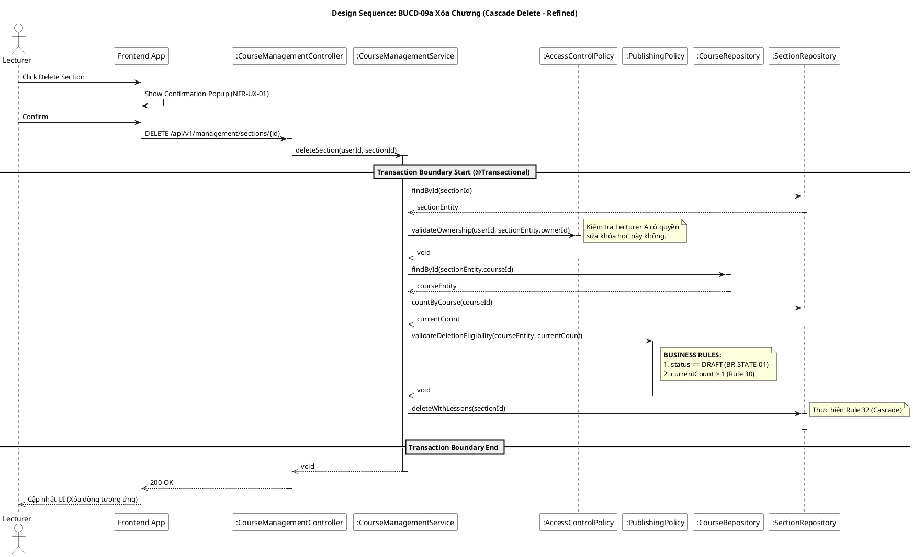
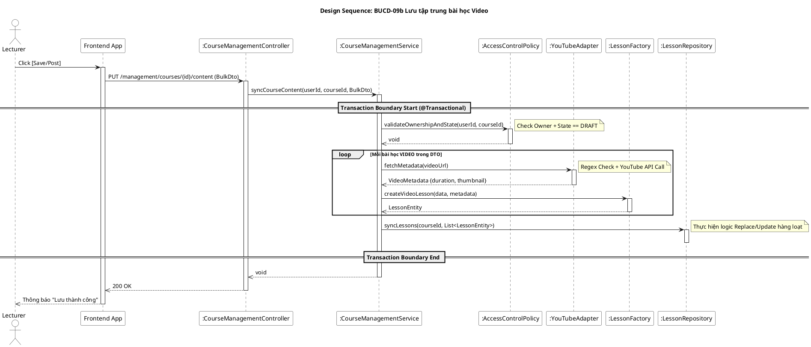
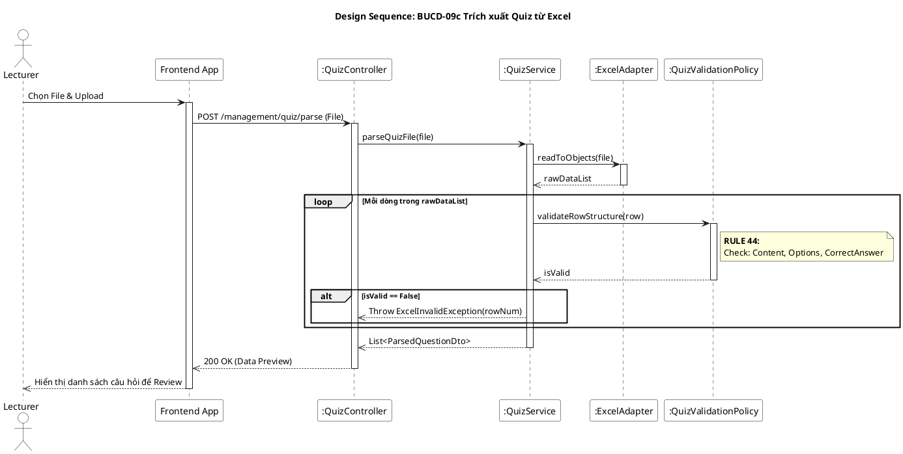
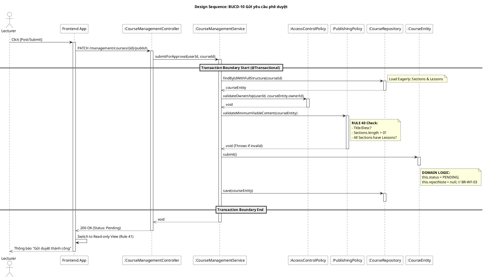
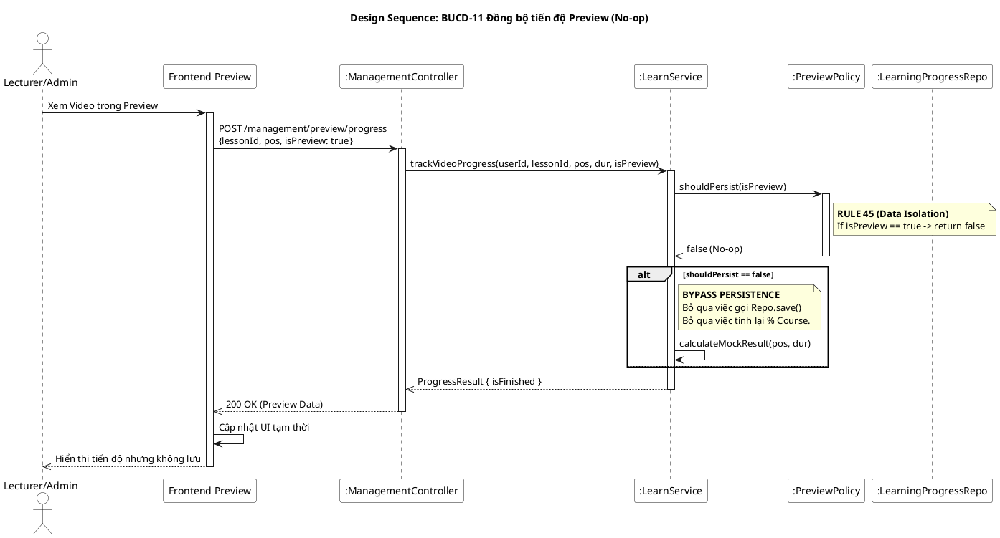
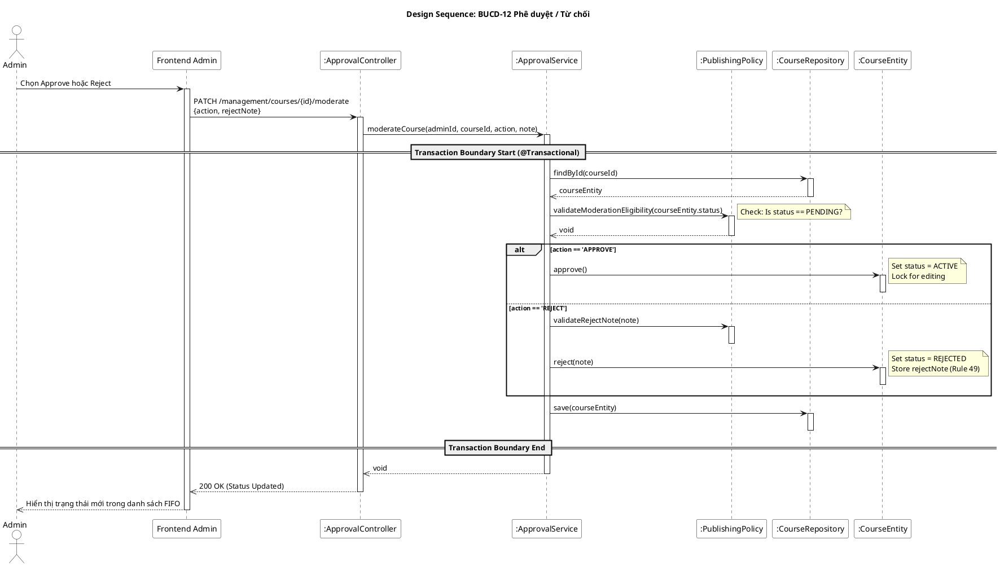

# Cụm 3

# UC 09a

```plantuml
@startuml
skinparam sequence {
    LifeLineBackgroundColor White
    ParticipantBackgroundColor White
    ActorBackgroundColor White
    NoteBackgroundColor #FEFECE
}

actor "Lecturer" as Actor
participant "Frontend App" as FE
participant ":CourseManagementController" as Controller
participant ":CourseManagementService" as Service
participant ":AccessControlPolicy" as AccessPolicy
participant ":PublishingPolicy" as StatePolicy
participant ":CourseRepository" as CourseRepo
participant ":SectionRepository" as SectionRepo

title Design Sequence: BUCD-09a Xóa Chương (Cascade Delete - Refined)

'--- Interaction ---
Actor -> FE: Click Delete Section
FE -> FE: Show Confirmation Popup (NFR-UX-01)
Actor -> FE: Confirm

    '--- API Call ---
    FE -> Controller: DELETE /api/v1/management/sections/{id}
    activate Controller

    Controller -> Service: deleteSection(userId, sectionId)
    activate Service

    '--- TRANSACTION START ---
    == Transaction Boundary Start (@Transactional) ==

        '--- Step 1: Access Control (BR-WF-02) ---
        Service -> SectionRepo: findById(sectionId)
        activate SectionRepo
        SectionRepo -->> Service: sectionEntity
        deactivate SectionRepo

        Service -> AccessPolicy: validateOwnership(userId, sectionEntity.ownerId)
        activate AccessPolicy
        note right: Kiểm tra Lecturer A có quyền\nsửa khóa học này không.
        AccessPolicy -->> Service: void
        deactivate AccessPolicy

        '--- Step 2: State & Structure Check (Domain Logic) ---
        Service -> CourseRepo: findById(sectionEntity.courseId)
        activate CourseRepo
        CourseRepo -->> Service: courseEntity
        deactivate CourseRepo

        Service -> SectionRepo: countByCourse(courseId)
        activate SectionRepo
        SectionRepo -->> Service: currentCount
        deactivate SectionRepo

        Service -> StatePolicy: validateDeletionEligibility(courseEntity, currentCount)
        activate StatePolicy
        note right of StatePolicy
           **BUSINESS RULES:**
           1. status == DRAFT (BR-STATE-01)
           2. currentCount > 1 (Rule 30)
        end note
        StatePolicy -->> Service: void
        deactivate StatePolicy

        '--- Step 3: Cascade Delete (Infra) ---
        Service -> SectionRepo: deleteWithLessons(sectionId)
        activate SectionRepo
        note right: Thực hiện Rule 32 (Cascade)
        deactivate SectionRepo

    '--- TRANSACTION END ---
    == Transaction Boundary End ==

    Service -->> Controller: void
    deactivate Service

    Controller -->> FE: 200 OK
    deactivate Controller

FE -->> Actor: Cập nhật UI (Xóa dòng tương ứng)
deactivate FE

@enduml
```

# UC 09b

```plantuml
@startuml
skinparam sequence {
    LifeLineBackgroundColor White
    ParticipantBackgroundColor White
    ActorBackgroundColor White
    NoteBackgroundColor #FEFECE
}

actor "Lecturer" as Actor
participant "Frontend App" as FE
participant ":CourseManagementController" as Controller
participant ":CourseManagementService" as Service
participant ":AccessControlPolicy" as AccessPolicy
participant ":YouTubeAdapter" as YTAdapter
participant ":LessonFactory" as Factory
participant ":LessonRepository" as LessonRepo

title Design Sequence: BUCD-09b Lưu tập trung bài học Video

'--- Interaction ---
Actor -> FE: Click [Save/Post]
activate FE

    FE -> Controller: PUT /management/courses/{id}/content (BulkDto)
    activate Controller

    Controller -> Service: syncCourseContent(userId, courseId, BulkDto)
    activate Service

    '--- TRANSACTION START ---
    == Transaction Boundary Start (@Transactional) ==

        '--- Step 1: Security & State Guard ---
        Service -> AccessPolicy: validateOwnershipAndState(userId, courseId)
        activate AccessPolicy
        note right: Check Owner + State == DRAFT
        AccessPolicy -->> Service: void
        deactivate AccessPolicy

        '--- Step 2: Process Lessons Loop ---
        loop Mỗi bài học VIDEO trong DTO

            '--- Step 3: Validate & Fetch Metadata (Rule 43 + FR-UC09b-01) ---
            Service -> YTAdapter: fetchMetadata(videoUrl)
            activate YTAdapter
            note right: Regex Check + YouTube API Call
            YTAdapter -->> Service: VideoMetadata {duration, thumbnail}
            deactivate YTAdapter

            '--- Step 4: Factory Pattern ---
            Service -> Factory: createVideoLesson(data, metadata)
            activate Factory
            Factory -->> Service: LessonEntity
            deactivate Factory

        end

        '--- Step 5: Bulk Persistence (Atomic Replacement) ---
        Service -> LessonRepo: syncLessons(courseId, List<LessonEntity>)
        activate LessonRepo
        note right: Thực hiện logic Replace/Update hàng loạt
        deactivate LessonRepo

    '--- TRANSACTION END ---
    == Transaction Boundary End ==

    Service -->> Controller: void
    deactivate Service

    Controller -->> FE: 200 OK
    deactivate Controller

FE -->> Actor: Thông báo "Lưu thành công"
deactivate FE

@enduml
```
# UC 09c

```plantuml
@startuml
skinparam sequence {
    LifeLineBackgroundColor White
    ParticipantBackgroundColor White
    ActorBackgroundColor White
    NoteBackgroundColor #FEFECE
}

actor "Lecturer" as Actor
participant "Frontend App" as FE
participant ":QuizController" as Controller
participant ":QuizService" as Service
participant ":ExcelAdapter" as Excel
participant ":QuizValidationPolicy" as Policy

title Design Sequence: BUCD-09c Trích xuất Quiz từ Excel

'--- Interaction ---
Actor -> FE: Chọn File & Upload
activate FE

    FE -> Controller: POST /management/quiz/parse (File)
    activate Controller

    Controller -> Service: parseQuizFile(file)
    activate Service

    '--- Step 1: Read File (Infra) ---
    Service -> Excel: readToObjects(file)
    activate Excel
    Excel -->> Service: rawDataList
    deactivate Excel

    '--- Step 2: Validation (Domain Policy) ---
    loop Mỗi dòng trong rawDataList
        Service -> Policy: validateRowStructure(row)
        activate Policy
        note right of Policy
           **RULE 44:**
           Check: Content, Options, CorrectAnswer
        end note
        Policy -->> Service: isValid
        deactivate Policy

        alt isValid == False
            Service -->> Controller: Throw ExcelInvalidException(rowNum)
        end
    end

    '--- Step 3: Response for Preview ---
    Service -->> Controller: List<ParsedQuestionDto>
    deactivate Service

    Controller -->> FE: 200 OK (Data Preview)
    deactivate Controller

FE -->> Actor: Hiển thị danh sách câu hỏi để Review
deactivate FE

@enduml
```
# UC 10

```plantuml
@startuml
skinparam sequence {
    LifeLineBackgroundColor White
    ParticipantBackgroundColor White
    ActorBackgroundColor White
    NoteBackgroundColor #FEFECE
}

actor "Lecturer" as Actor
participant "Frontend App" as FE
participant ":CourseManagementController" as Controller
participant ":CourseManagementService" as Service
participant ":AccessControlPolicy" as AccessPolicy
participant ":PublishingPolicy" as PubPolicy
participant ":CourseRepository" as CourseRepo
participant ":CourseEntity" as Entity

title Design Sequence: BUCD-10 Gửi yêu cầu phê duyệt

'--- Interaction ---
Actor -> FE: Click [Post/Submit]
activate FE

    FE -> Controller: PATCH /management/courses/{id}/publish
    activate Controller

    Controller -> Service: submitForApproval(userId, courseId)
    activate Service

    '--- TRANSACTION START ---
    == Transaction Boundary Start (@Transactional) ==

        '--- Step 1: Security Guard ---
        Service -> CourseRepo: findByIdWithFullStructure(courseId)
        activate CourseRepo
        note right: Load Eagerly: Sections & Lessons
        CourseRepo -->> Service: courseEntity
        deactivate CourseRepo

        Service -> AccessPolicy: validateOwnership(userId, courseEntity.ownerId)
        activate AccessPolicy
        AccessPolicy -->> Service: void
        deactivate AccessPolicy

        '--- Step 2: Structural Validation (Rule 40) ---
        Service -> PubPolicy: validateMinimumViableContent(courseEntity)
        activate PubPolicy
        note right of PubPolicy
           **RULE 40 Check:**
           - Title/Desc?
           - Sections.length > 0?
           - All Sections have Lessons?
        end note
        PubPolicy -->> Service: void (Throws if invalid)
        deactivate PubPolicy

        '--- Step 3: State Transition (Rich Domain) ---
        Service -> Entity: submit()
        activate Entity
        note right of Entity
           **DOMAIN LOGIC:**
           this.status = PENDING;
           this.rejectNote = null; // BR-WF-03
        end note
        deactivate Entity

        '--- Step 4: Persist ---
        Service -> CourseRepo: save(courseEntity)
        activate CourseRepo
        deactivate CourseRepo

    '--- TRANSACTION END ---
    == Transaction Boundary End ==

    Service -->> Controller: void
    deactivate Service

    Controller -->> FE: 200 OK (Status: Pending)
    deactivate Controller

FE -> FE: Switch to Read-only View (Rule 41)
FE -->> Actor: Thông báo "Gửi duyệt thành công"
deactivate FE

@enduml
```
# UC 11

```plantuml
@startuml
skinparam sequence {
    LifeLineBackgroundColor White
    ParticipantBackgroundColor White
    ActorBackgroundColor White
    NoteBackgroundColor #FEFECE
}

actor "Lecturer/Admin" as Actor
participant "Frontend Preview" as FE
participant ":ManagementController" as Controller
participant ":LearnService" as Service
participant ":PreviewPolicy" as Policy
participant ":LearningProgressRepo" as Repo

title Design Sequence: BUCD-11 Đồng bộ tiến độ Preview (No-op)

'--- Interaction ---
Actor -> FE: Xem Video trong Preview
activate FE

    FE -> Controller: POST /management/preview/progress \n{lessonId, pos, isPreview: true}
    activate Controller

    Controller -> Service: trackVideoProgress(userId, lessonId, pos, dur, isPreview)
    activate Service

    '--- POLICY GATE ---
    Service -> Policy: shouldPersist(isPreview)
    activate Policy
    note right of Policy
       **RULE 45 (Data Isolation)**
       If isPreview == true -> return false
    end note
    Policy -->> Service: false (No-op)
    deactivate Policy

    alt shouldPersist == false
        note right of Service
           **BYPASS PERSISTENCE**
           Bỏ qua việc gọi Repo.save()
           Bỏ qua việc tính lại % Course.
        end note
        Service -> Service: calculateMockResult(pos, dur)
    else
        'Logic bình thường của BUCD-06/08
    end

    Service -->> Controller: ProgressResult { isFinished }
    deactivate Service

    Controller -->> FE: 200 OK (Preview Data)
    deactivate Controller

FE -> FE: Cập nhật UI tạm thời
FE -->> Actor: Hiển thị tiến độ nhưng không lưu
deactivate FE

@enduml
```
# UC 12

```plantuml
@startuml
skinparam sequence {
    LifeLineBackgroundColor White
    ParticipantBackgroundColor White
    ActorBackgroundColor White
    NoteBackgroundColor #FEFECE
}

actor "Admin" as Actor
participant "Frontend Admin" as FE
participant ":ApprovalController" as Controller
participant ":ApprovalService" as Service
participant ":PublishingPolicy" as StatePolicy
participant ":CourseRepository" as Repo
participant ":CourseEntity" as Entity

title Design Sequence: BUCD-12 Phê duyệt / Từ chối

'--- Interaction ---
Actor -> FE: Chọn Approve hoặc Reject
activate FE

    FE -> Controller: PATCH /management/courses/{id}/moderate \n{action, rejectNote}
    activate Controller

    Controller -> Service: moderateCourse(adminId, courseId, action, note)
    activate Service

    '--- TRANSACTION START ---
    == Transaction Boundary Start (@Transactional) ==

        '--- Step 1: Guard & State Check ---
        Service -> Repo: findById(courseId)
        activate Repo
        Repo -->> Service: courseEntity
        deactivate Repo

        Service -> StatePolicy: validateModerationEligibility(courseEntity.status)
        activate StatePolicy
        note right: Check: Is status == PENDING?
        StatePolicy -->> Service: void
        deactivate StatePolicy

        '--- Step 2: Processing Action (Rich Domain) ---
        alt action == 'APPROVE'
            Service -> Entity: approve()
            activate Entity
            note right: Set status = ACTIVE\nLock for editing
            deactivate Entity
        else action == 'REJECT'
            Service -> StatePolicy: validateRejectNote(note)
            activate StatePolicy
            deactivate StatePolicy

            Service -> Entity: reject(note)
            activate Entity
            note right: Set status = REJECTED\nStore rejectNote (Rule 49)
            deactivate Entity
        end

        '--- Step 3: Persistence ---
        Service -> Repo: save(courseEntity)
        activate Repo
        deactivate Repo

    '--- TRANSACTION END ---
    == Transaction Boundary End ==

    Service -->> Controller: void
    deactivate Service

    Controller -->> FE: 200 OK (Status Updated)
    deactivate Controller

FE -->> Actor: Hiển thị trạng thái mới trong danh sách FIFO
deactivate FE

@enduml
```
